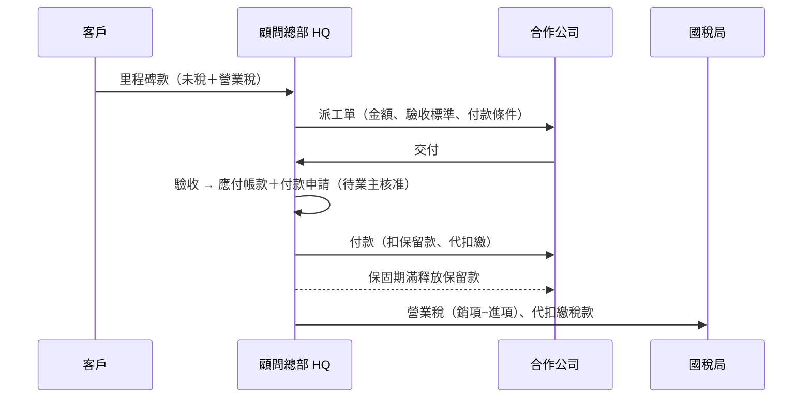

# 金流設計：接案 → 下派給其他公司 → 收付款

> 程式：`consultancy/firm.py`（流程與政策）、`consultancy/ledger.py`（複式記帳）。
> ⚠️ 稅率、扣繳與發票規則為一般性設定，實際適用請與會計師確認。

## 1. 錢怎麼流



## 2. 兩種派工金流模式

| | 轉包 `subcontract` | 代收代付 `pass_through` |
|---|---|---|
| 誰跟客戶簽約／開發票 | HQ | 合作公司直接開給客戶 |
| HQ 收入 | 全額認列顧問服務收入 | 只認列佣金收入 |
| 派工金額 | 未稅，營業稅另計 | 合作公司發票總額（含稅） |
| 主要風險 | 毛利被外包吃掉、HQ 先墊錢 | 代收款被誤用成營運資金 |
| 系統防線 | 毛利底線、Pay-when-paid | 代收未滿額不得驗收結算 |

## 3. 金流政策（`TreasuryPolicy`，皆可調）

| 政策 | 預設 | 用途（對應顧問） |
|---|---|---|
| `min_margin_rate` | 30% | 派工後預估毛利率低於此值就擋下，需業主 `override_by` 核准（冥王星停損線） |
| `pay_when_paid` | 開 | 對應的客戶里程碑未付清、或本案客戶款不足以支應累計外包款時，不付外包（避免 HQ 墊錢） |
| `min_cash_reserve_cents` | 50,000 元 | 付款後現金不得低於安全準備金（冥王星安全底盤） |
| `default_retention_rate` / `warranty_days` | 10% / 30 天 | 保留款，保固期滿才可付（土星品質紀律） |
| `default_commission_rate` | 15% | 代收代付抽佣（木星平台化） |
| `vat_rate` | 5% | 營業稅 |
| 人工核准 | 必要 | `approve_payment` 需具名真人，`ai`／`bot`／`grok` 會被拒絕（天王星） |

## 4. 付款三道閘門

```
付款申請 PENDING_APPROVAL
   │ approve_payment(具名業主)
   ▼
APPROVED ──► payment_blockers() 全部通過？
               ├ 已人工核准
               ├ 保留款：已過保固期
               ├ Pay-when-paid：客戶款已入帳
               └ 現金足夠且付款後 ≥ 安全準備金
   │ 業主在網銀實際匯款後 record_payment(銀行序號)
   ▼
PAID（入帳，對方若為關係企業同步入其帳本）
```

系統**不會自己轉帳**；它只告訴你「這筆能不能付、為什麼不能」。

## 5. 分錄對照表（HQ 帳）

| 事件 | 借 | 貸 |
|---|---|---|
| 對客戶開發票 | 應收帳款（含稅） | 預收款（未稅）、銷項稅額 |
| 客戶付款 | 現金 | 應收帳款 |
| 客戶驗收里程碑 | 預收款 | 顧問服務收入 |
| 驗收外包（轉包） | 外包成本、進項稅額 | 應付帳款、應付保留款、代扣繳稅款 |
| 代收客戶款（代收代付） | 現金 | 代收款 |
| 代收代付結算 | 代收款 | 佣金收入、銷項稅額、應付帳款 |
| 付外包款 | 應付帳款／應付保留款 | 現金 |
| 繳代扣繳 | 代扣繳稅款 | 現金 |
| 營業稅申報 | 銷項稅額 | 進項稅額、現金（差額） |

範例（轉包 50,000 元給可開發票的公司）：成本 50,000、進項稅 2,500 → 驗收後付 47,500、保留 5,000。
範例（個人文案 20,000 元、扣繳 10%）：無營業稅 → 先付 16,000、保留 2,000、代扣 2,000 繳國稅局。

## 6. 現金預測

`firm.forecast(start, weeks)` 以週為單位彙整：

- 流入：已請款未收（依到期日）、未請款里程碑（預計日＋客戶付款天數）、未收齊的代收款
- 流出：待付款申請、尚未驗收的派工（預計交付＋付款條件）、保留款釋放、稅款（簡化為次月 15 日）
- 每週標記 `below_reserve`；`firm.snapshot()` 會把第一個預警週次放進智囊團 prompt，讓顧問建議「提前請款」或「延後派工」。

## 7. 尚未涵蓋（後續可加）

- [ ] 資料持久化（目前為記憶體；可接 SQLite／Supabase）
- [ ] 客戶退款、爭議與呆帳流程
- [ ] 多幣別與匯差
- [ ] 合併報表自動沖銷關係企業內部交易
- [ ] 營業稅實際申報期別（雙月）與電子發票串接
