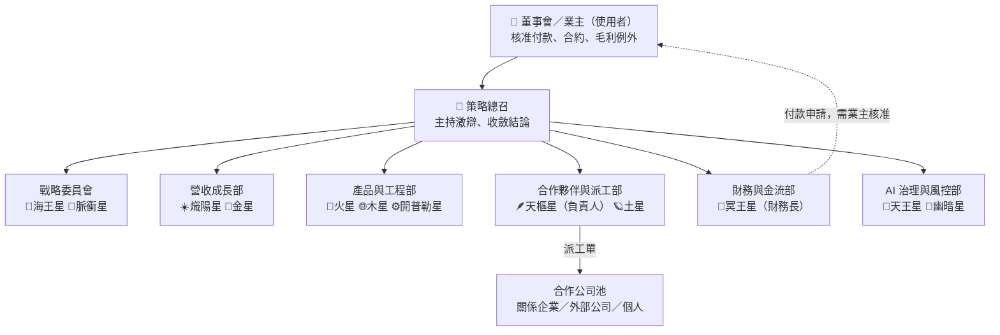

# 組織章程：宇宙行星顧問團隊公司

> 來源：`prompts/grok_manu_bot_001.md` 的 12 位顧問。本文件把「智囊團」變成可以接案、派工、管錢的公司。程式定義見 `consultancy/advisors.py`。

## 1. 治理結構

- **決策權只在業主身上。** AI 角色（含策略總召）只能建議、產生派工單草稿與付款申請，不能核准，也不能宣稱已付款。
- 🔮 幽暗星只提供象徵性與創意提醒，結論中必須標示為假設。

## 2. 部門與公司職責

| 部門 | 顧問 | 在公司裡負責 |
|---|---|---|
| 戰略委員會 | 🎣 海王星 | 長線客群經營、接案時機判斷 |
| | 🧭 脈衝星 | 哪些案子值得接、哪些該轉介合作公司 |
| 營收成長部 | ☀️ 熾陽星 | 對客戶報價、對外包議價（價差＝毛利） |
| | 💎 金星 | 外包產出交付前的品牌與體驗審查 |
| 產品與工程部 | 🚀 火星 | MVP、判斷自做／AI 做／外包 |
| | 🌐 木星 | 合作公司池平台化、抽佣模式、KPI |
| | ⚙️ 開普勒星 | 派工、驗收、付款申請的自動化串接 |
| 合作夥伴與派工部 | 🪶 天樞星 | **負責人**：選合作公司、備援名單、外包風險矩陣 |
| | 🪐 土星 | 驗收標準、供應商品質紀律 |
| 財務與金流部 | 📜 冥王星 | **財務長**：現金水位、安全準備金、毛利底線、付款排程 |
| AI 治理與風控部 | 🧠 天王星 | 人工核准閘門、AI 輸出驗證 |
| | 🔮 幽暗星 | 客戶／合作夥伴的信任訊號（僅供參考） |

## 3. 派工流程 RACI

R＝執行、A＝最終負責（核准）、C＝諮詢、I＝知會

| 步驟 | 業主 | 策略總召 | 天樞星 | 土星 | 熾陽星 | 冥王星 | 天王星 |
|---|---|---|---|---|---|---|---|
| 決定是否外包 | A | R | C | C | | C | |
| 挑選合作公司（主力＋備援） | A | | R | C | | | I |
| 議價與報價 | A | | C | | R | C | |
| 毛利檢查（低於底線需例外核准） | A | | | | C | R | |
| 發出派工單 | A | I | R | | | I | |
| 驗收交付物 | A | | C | R | | | C |
| 付款申請 → 核准 → 匯款回填 | A / R | | | | | R | C |
| 保留款釋放 | A | | | R | | R | |

## 4. 合作公司分類

| 類型 | 程式 `CompanyKind` | 特點 |
|---|---|---|
| 顧問總部 | `HQ` | 唯一；接案、開發票、收款、派工 |
| 關係企業 | `INTERNAL` | 同一業主的其他公司；系統同步記對方帳本，方便合併報表時沖銷內部交易 |
| 外部公司／個人 | `EXTERNAL` | 依是否可開發票（`vat_registered`）與扣繳率（`withholding_rate`）計算付款 |

## 5. 智囊團召集規則

`consultancy/council.py` 會依問題分流挑 4–6 位顧問：

- 9 種分流：原有 8 種 ＋「外包派工與合作夥伴」。
- 問題涉及**金流或派工**時，📜 冥王星與 🪶 天樞星必定出席。
- system prompt ＝ 原始 md（自動去除 `[cite: N]` 標記）＋ `prompts/company_ops_addendum.md` ＋ 本次召集名單 ＋ 公司即時財務狀態。
